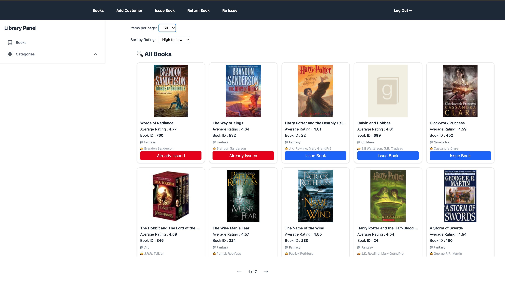
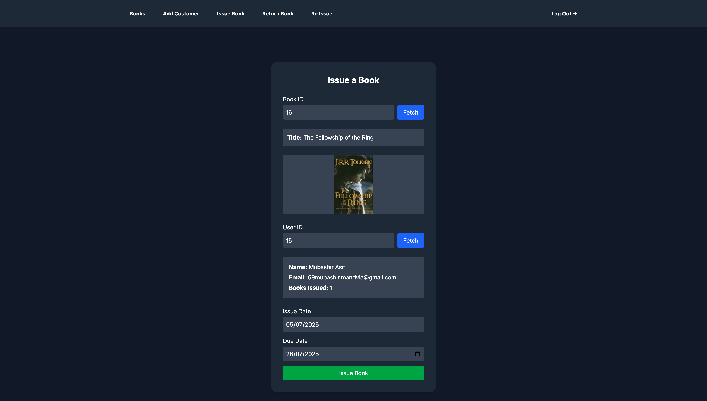
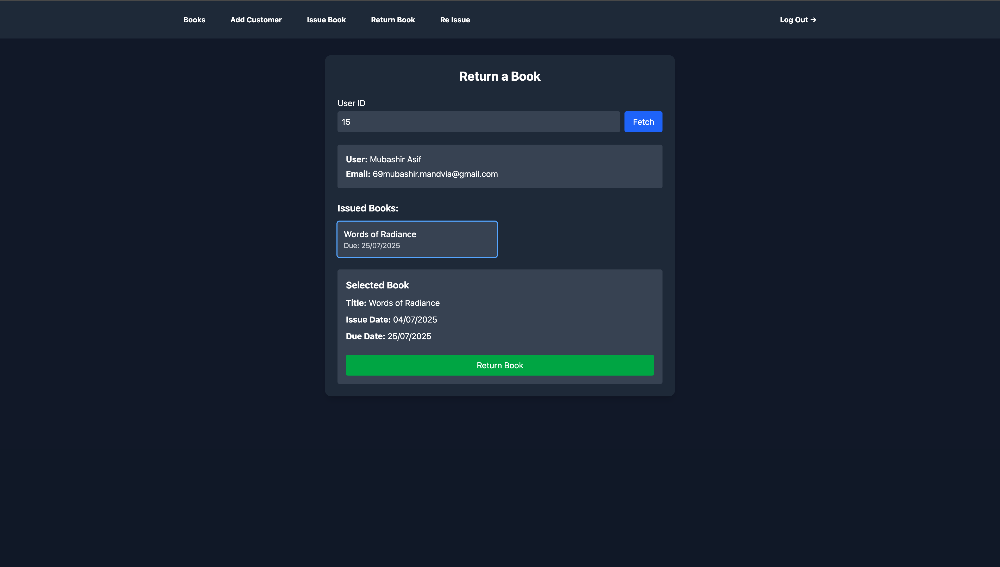

# 📚 Library Management

A simple full-stack Library Management System where users can issue, reissue, extend due dates, add new books, and manage user records.

---

## 🚀 Features

- 📖 Book Issue / Reissue / Return
- ➕ Add New Users and Books
- ⏰ Extend Book Due Dates
- 📃 View Issued Book Lists
- ❌ No login/auth required

---

## 🛠️ Tech Stack

| Frontend        | Backend         | Database |
|----------------|-----------------|----------|
| React + TailwindCSS | Node.js + Express + TypeScript | MySQL     |

---

## 💻 Local Setup

Clone the repo and run the following commands:

### Backend
```bash
cd backend
npm install
npx nodemon app.js
```

### Frontend
```bash
cd frontend
npm install
npm run dev
```

---

---

## 🎯 API Highlights

### 📚 Book Routes

- `GET /getallbooksdata` – Fetch all books  
- `POST /getspecificbooksdata` – Fetch books by filters  
- `POST /getsinglebookdata` – Get one book's full details  
- `POST /issuebook` – Issue a book to a user  
- `POST /returnbook` – Return a book  
- `POST /reissuebook` – Reissue an already-issued book  

### 👤 User Routes

- `POST /createuser` – Register a new user  
- `POST /loginuser` – Login an existing user  
- `POST /logout` – Logout a user  
- `POST /createcustomer` – Create a new customer  
- `GET /getuserdetails/:userid` – Get specific user info  
- `GET /getissuedbooks/:userid` – Get all issued books for a user  


---

## 📸 Screenshots






---

## 📦 Cool Badges


---

## 🙌 Contributing

Feel free to fork, clone, and raise PRs. Feedback and ideas are welcome!

---


## 📊 Pagination Support

Several endpoints support pagination using `page` and `limit` query parameters:


## ✨ Acknowledgements

Built with 💻 by Mubashir Asif